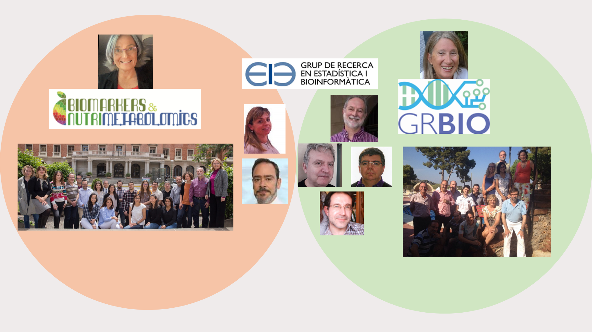

# About us

Our group was born in the former Statistics Department of the Faculty of Biology, that has now evolved into the [Genetics, Microbiology and Statistics department](https://web.ub.edu/ca/web/departament-genetica).

Our strong interdisciplinary vocation has lead us to collaborate and become integrated with other research groups. While we are not a "Consolidated Research Group" of the Generalitat de Catalunya, we have been strongly related with two of them work with two of them.

Many of our members have also been since its creation in the GRBio, [Grup de Recerca en Bioestadística i Bioinformàtica](http://grbio.upc.edu) research group, a consolidated research group of the Generalitat de Catalunya, with whom we share orientations and research interests.

The evolution of our research has led us to integrate in the [Biomarkers in Nutrition and Metabolomic Research Group](http://www.ub.edu/nutrimetabolomics.edu) with whom we work together in a variety of projects in the interface between metabolomics, and nutrition.

Besides this, we have a kind relation with the [Statistics and Bioinformatics Unit (UEB)](http://ueb.vhir.org) in [Vall d'Hebron Research Institute (VHIR)](http://www.vhir.org), which we contributed to create and which was led by Alex Sanchez for more than 12 years (2008-2020).

<!-- 
 -->
<!-- {width="70%" align="center"} -->
<!-- 
 -->
